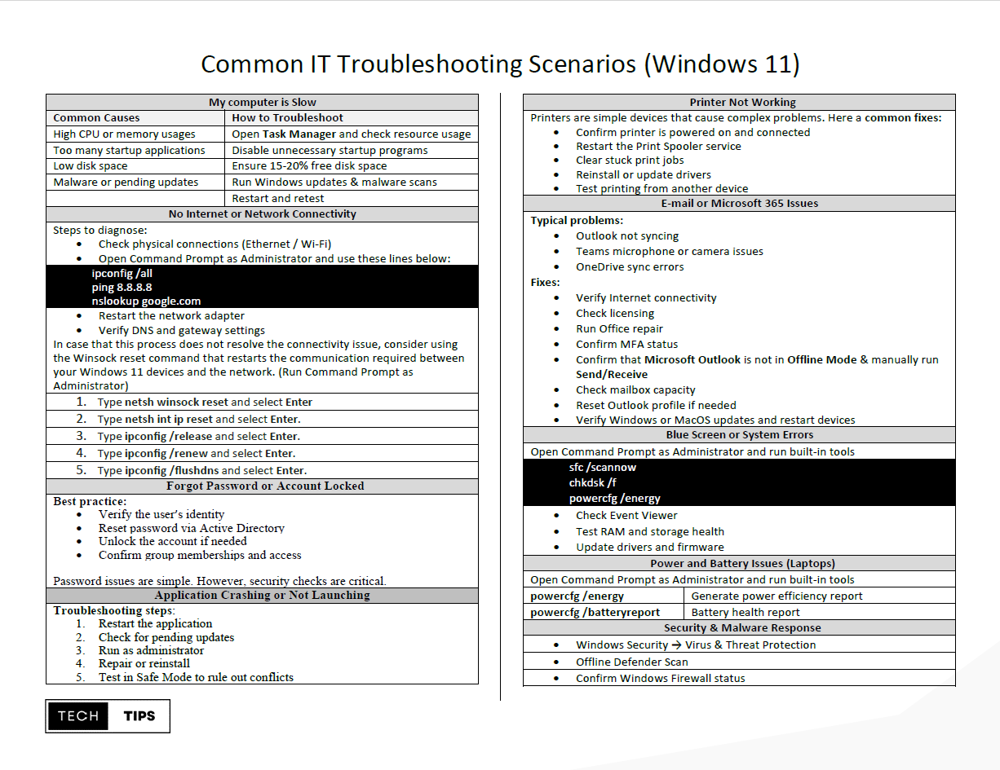

### Common IT Troubleshooting Scenarios for Windows 11

This guide outlines common Windows 11 issues encountered in help desk and junior system administrator roles. As an IT professional or system administrator, understanding how to quickly diagnose and resolve these problems is essential. The focus is on practical troubleshooting steps for some of the most common Windows 11 support scenarios encountered in home and enterprise environments.

---

## Slow System Performance 

### Common Symptoms
- Slow boot or shutdown
- Applications freezing or crashing
- High CPU, memory, or disk usage

### Troubleshooting Steps
1. **Check system resources**
- Open **Task Manager** (`Ctrl + Shift + Esc`) and identify high-usage processes.
     
2. **Restart the system**
- Clears temporary system and memory issues.
     
3. **Install Windows and driver updates**
- Go to **Settings → Windows Update** and confirm the system is fully patched.
     
4. **Run System File Checker** to scan and repair corrupted system files
  
   Open Command Prompt and run **sfc /scannow**

5. **Disable unnecessary startup apps**
- Task Manager --> Startup tab.

---

## Network and Internet Connectivity Problems

**Common Symptoms**
- “No Internet” despite Wi‑Fi connection
- Intermittent connection drops
- Unable to access internal or external resources

**Steps to Diagnose**
- Check physical connections (Ethernet / Wi-Fi)
- Open Command Prompt as Administrator and use these lines below:

**ipconfig /all** 
**ping 8.8.8.8** 
**nslookup google.com**

- Restart the network adapter

**Settings → System → Troubleshoot → Other troubleshooters → Internet Connections / Network Adapter**

- Verify DNS and gateway settings.

In case that this process does not resolve the connectivity issue, consider using the Winsock reset command that restarts the communication required between your Windows 11 devices and the network. (Run Command Prompt as Administrator)

1. Type netsh winsock reset and select Enter
2. Type netsh int ip reset and select Enter.
3. Type ipconfig /release and select Enter.
4. Type ipconfig /renew and select Enter.
5. Type ipconfig /flushdns and select Enter.

---

## Printer is not working

### Symptoms
- Printer appears offline
- Print jobs stuck in queue
- Unable to detect printer

### Troubleshooting Steps
Verify Physical Connections

- USB cable
- Network connection
- Printer power status

### Restart the Print Spooler
1. Press **Win** + **R**
2. Type: **services.msc**
3. Locate **Print Spooler**
4. Restart the service

### Clear the Print Queue
1. Open PowerShell and type in the following command line
   **C:\Windows\System32\spool\PRINTERS**
2. Delete pending print jobs

### Reinstall Printer Drivers

Download the latest drivers from the printer manufacturer’s website.

---

## Blue Screen of Death (BSOD) or System Errors

- Open Command Prompt as Administrator and run built-in tools

  **sfc /scannow**
  **chkdsk /f**
  **powercfg /energy**

- Check Event Viewer
- Test RAM and storage health
- Update drivers and firmware Power and Battery Issues

--- 

## Final Thoughts

Troubleshooting Windows 11 relies on strong technical fundamentals, logical problem‑solving, and effective communication. Using a structured approach when handling issues such as network connectivity, update failures, or Microsoft 365 support helps reduce downtime and maintain system reliability.

[Common IT Troubleshooting Scenarios (PDF Download)](pdf/Common IT Troubleshooting Scenarios.pdf)
