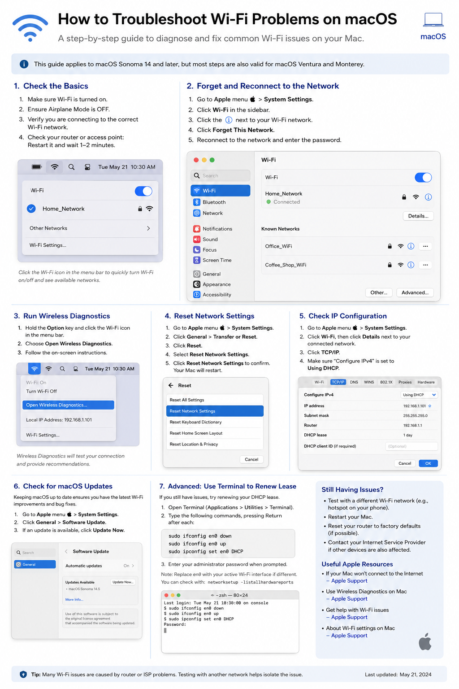

i-Fi issues on a Mac can be frustrating—but many common connectivity problems can be diagnosed and resolved without advanced troubleshooting.
I put together this step-by-step guide covering some of the most useful troubleshooting techniques, including:
🔹 Checking the basic Wi-Fi and router settings
🔹 Forgetting and reconnecting to a wireless network
🔹 Running Wireless Diagnostics
🔹 Resetting network settings
🔹 Checking IP and DHCP configuration
🔹 Installing macOS updates
🔹 Renewing the DHCP lease using Terminal
🔹 Testing with another Wi-Fi network to isolate the problem 

The goal is to work through the troubleshooting process systematically and determine whether the issue is with the Mac, network configuration, router, or Internet service provider.

💡 Tip: If other devices are experiencing the same connectivity problem, the issue may be with the router or ISP rather than your Mac.

I hope this guide is useful for anyone supporting Macs at home, in the workplace, or in an IT support environment.

