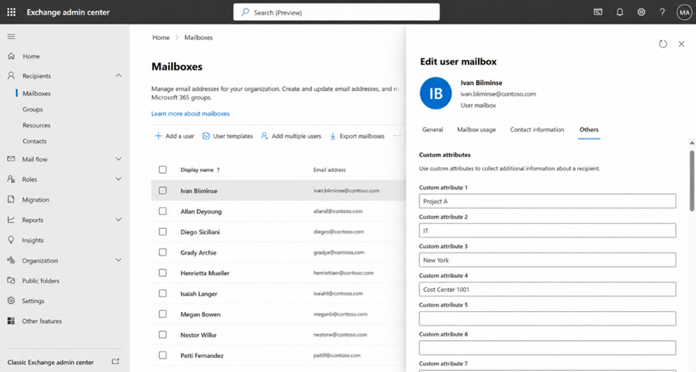

In modern enterprise environments, email distribution at scale still underpins critical communication workflows. **Microsoft 365 Exchange Online Distribution Lists** remain a powerful tool in an IT professional’s toolkit.

This article breaks down how to **design, automate, and manage Distribution Lists using PowerShell**, with a special focus on **Dynamic Distribution Lists (DDLs)**.

---

### What are Microsoft 365 Distribution Lists?

**Distribution lists** (also known as distribution groups) are email-enabled objects that allow you to send a single message to multiple recipients. Instead of emailing individuals one by one, a distribution list lets you:

- Send messages to a group using one address
- Manage members centrally
- Simplify communication across teams or departments

They are commonly used for:

- Department-wide announcements
- Notifications and alerts
- Shared communication channels

However, they are **not designed for collaboration**.

---

### Distribution Lists vs Microsoft 365 Groups

A common mistake is using distribution lists where a Microsoft 365 Group would be a better fit. Here is the key difference.

If your users need to collaborate, share files, or track conversations, a **Microsoft 365 Group is usually the better choice**.

---

### Static vs Dynamic Distribution Lists

Microsoft 365 supports two primary types:

#### Static Distribution Lists
Fixed membership (manually maintained)
Best for small or stable teams
Simple but requires ongoing admin effort

#### Dynamic Distribution Lists (DDL)
Membership is calculated dynamically at send time
Based on attributes like: Department Job title Location Custom attributes

**Key takeaways:** Dynamic Distribution Lists do not store members. They evaluate recipients when the email is sent, reducing manual maintenance but limiting visibility in the admin GUI interface online.

---

### How IT Pros Actually Use Dynamic Distribution Lists

**Dynamic Distribution Lists** are ideal for:

- Automated project-based communication groups
- Organizational announcements by department
- Compliance-driven segmentation (e.g., region-based)
- Temporary initiatives without manual cleanup

Instead of managing users directly, you tag users with attributes, and let Exchange do the rest.

---

### Importing Users into a Dynamic Distribution Group

**Important:** You cannot directly import users into a Dynamic Distribution Group (DDG). Instead, you assign attributes to users and configure the DDG to include users based on those attributes.

Here’s a clean CSV template you can use:

**UserPrincipalName,CustomAttribute1
user1@company.com,ProjectA
user2@company.com,ProjectA
user3@company.com,ProjectA** 

---

### PowerShell Workflow for Automation

1. Connect to Exchange Online

**Install-Module ExchangeOnlineManagement
Import-Module ExchangeOnlineManagement
Connect-ExchangeOnline -UserPrincipalName admin@yourdomain.com**

2. Import CSV and Assign Attributes

**$users = Import-Csv "C:\scripts\users.csv"**

**foreach ($user in $users) {
    Set-Mailbox -Identity $user.UserPrincipalName**

3. Create the Dynamic Distribution List

**New-DynamicDistributionGroup `
 -Name "ProjectA Users" `
 -RecipientFilter {(RecipientType -eq 'UserMailbox') -and (CustomAttribute1 -eq 'ProjectA')}**

4. Verify Membership (Important Debug Step)

**Get-Recipient -RecipientPreviewFilter (Get-DynamicDistributionGroup "ProjectA Users").RecipientFilter**

---

### Exporting Distribution List Members

Dynamic lists don’t expose membership in the admin center—PowerShell is the only supported method.

**Get-DistributionGroupMember -Identity "AllStaff" |
Select DisplayName, PrimarySmtpAddress |
Export-Csv "C:\Reports\AllStaff-Members.csv" -NoTypeInformation**

Important considerations:

- This export is a point-in-time snapshot
- DDL membership changes dynamically based on attributes
- Only mail-enabled recipients are included

---

### Editing Attributes (GUI or PowerShell)

**Option 1: Exchange Admin Center**

- Sign in to the Exchange admin center
- Navigate to Recipients → Mailboxes
- Open a mailbox
- Edit Custom Attributes 1–15
- Save changes

---

**Option 2: PowerShell**

**Set-Mailbox user@domain.com -CustomAttribute1 "ProjectA"**

Clear attribute:

**Set-Mailbox user@domain.com -CustomAttribute1 $null**

Bulk Update

**"user1@domain.com","user2@domain.com" |
ForEach-Object { Set-Mailbox $_ -CustomAttribute**

---

### Final Thoughts
For IT professionals managing Microsoft 365 environments, Dynamic Distribution Lists are a force multiplier:

- Reduce manual group maintenance
- Enable scalable communication strategies
- Align email targeting with identity data

Mastering DDLs—especially with PowerShell—positions you as a forward-thinking admin capable of building automated, attribute-driven systems rather than manual processes.

**Disclaimer:**
Please note that any PowerShell commands provided are to be used at your own risk and discretion. Running scripts comes with inherent risks. While every effort has been made to ensure accuracy, improper use of these commands can result in unintended consequences, including system instability or data loss. It is recommended to back up important data and create a system restore point before executing any PowerShell commands. Prior to deploying scripts in a live environment, consider testing with virtual machines. If you are unsure about any command or its potential impact, please seek assistance from a qualified IT professional.

