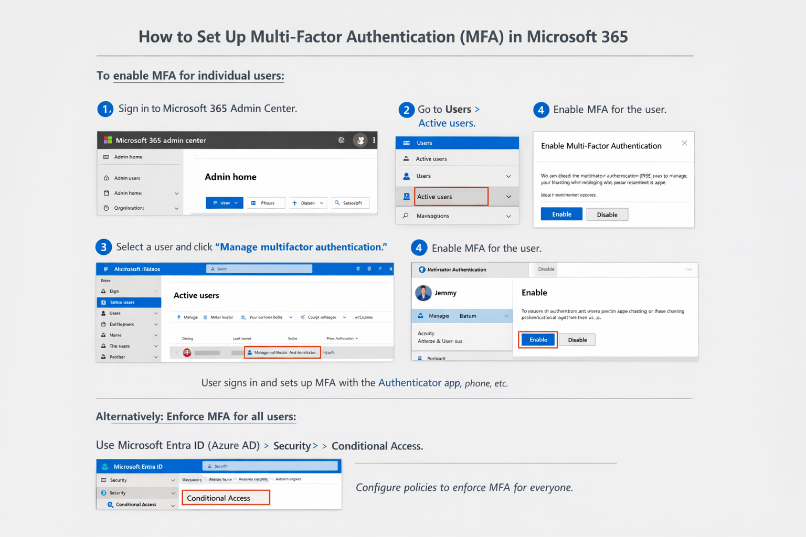
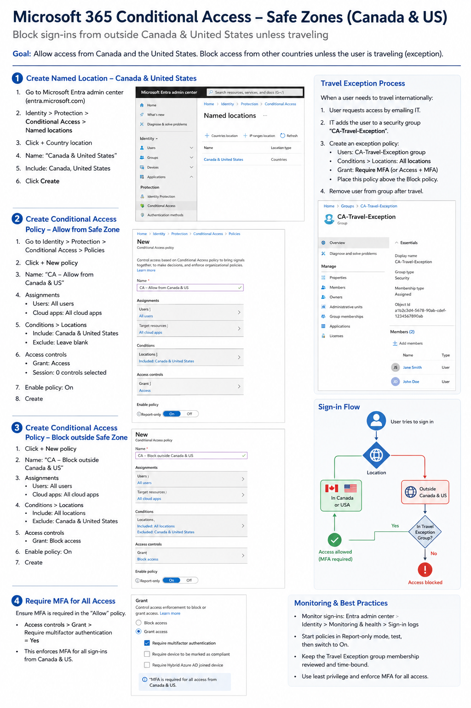

Modern organizations prioritize security, and protecting user identities is critical in a cloud-first world. **Multi-Factor Authentication (MFA)** and **Conditional Access** work together to create a strong security foundation:

- **MFA** adds an extra layer of verification beyond passwords.
- **Conditional Access** enforces security requirements based on user, device, and risk conditions.

This guide provides a practical overview of configuring MFA and Conditional Access in Microsoft 365, with links to official Microsoft Learn resources for deeper reference. Implementing MFA and Conditional Access is a key step toward Zero Trust security, reducing the risk of compromised accounts and unauthorized access.

---

### Step 1: Enable MFA in Your Tenant
Use Microsoft Entra Admin Center

The recommended method is through the Microsoft Entra admin center:

1. Sign in to [https://entra.microsoft.com](https://entra.microsoft.com) --> with an admin account (Global Administrator or Conditional Access Administrator).
2. Navigate to **0Identity > Protection > Multifactor Authentication.**
3. From the **Getting started** page, go to **Configure > Additional cloud-based MFA settings**.
4. Select your preferred authentication methods (like authenticator app, phone call, SMS).
5. Optionally configure **trusted IPs** (bypass locations) and other settings.

**Tip**: If you use **Security defaults**, MFA is automatically enabled for your organization. However, Conditional Access policies require disabling Security defaults first.

[Microsoft Learn — Official step-by-step tutorial](https://learn.microsoft.com/azure/active-directory/authentication/tutorial-enable-azure-mfa)

---

### Step 2: Create a Conditional Access Policy

#### Example: Require MFA for All Users

1. Go to **Entra ID > Conditional Access > Policies.**
2. Choose **+ New policy** and give it a meaningful name (e.g., Require MFA All Users).
3. Under **Assignments > Users or workload identities**, select **All users**.
4. Exclude emergency backup accounts to prevent lockout.
5. Under **Cloud apps or actions**, select **All cloud apps.**
6. Under **Access controls > Grant**, choose **Require multifactor authentication**.
7. Set the policy to **On** and create it.

This ensures all users are required to use MFA when accessing resources covered by this policy.

- [Microsoft Learn — Create Conditional Access to require MFA for all users](https://learn.microsoft.com/entra/identity/conditional-access/policy-all-users-mfa-strength)
- [Microsoft Learn — Require MFA for admins with CA](https://learn.microsoft.com/entra/identity/conditional-access/policy-old-require-mfa-admin)

---

#### Quick Links to Official Microsoft Learn

- [Conditional Access in Microsoft Entra ID](https://learn.microsoft.com/en-us/entra/identity/conditional-access/)
- [Enable Azure MFA](learn.microsoft.com/azure/active-directory/authentication/tutorial-enable-azure-mfa)
- [Enable per-user MFA in Microsoft Entra ID](https://learn.microsoft.com/en-us/entra/identity/authentication/tutorial-enable-azure-mfa)
- [Require MFA for all users (CA)](learn.microsoft.com/entra/identity/conditional-access/policy-all-users-mfa-strength)
- [Require MFA for admins (CA)](learn.microsoft.com/entra/identity/conditional-access/policy-old-require-mfa-admin)
- [Zero Trust Security Principles: Microsoft Zero Trust Guidance](https://www.microsoft.com/en-us/security/business/zero-trust)

---
#### Here are two infographics for reference. 

---

#### [Go to the Home Page](/)

